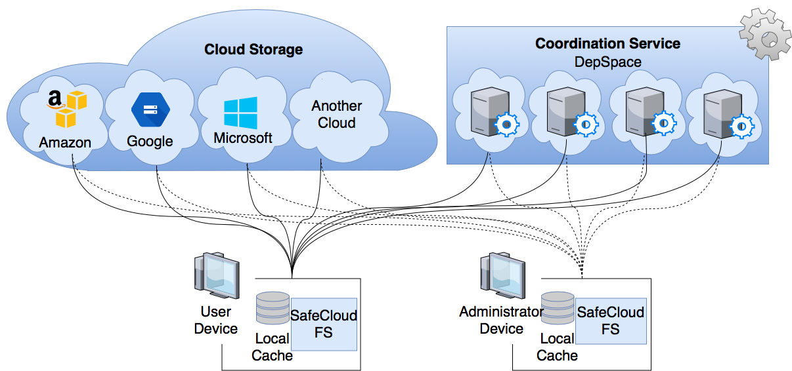
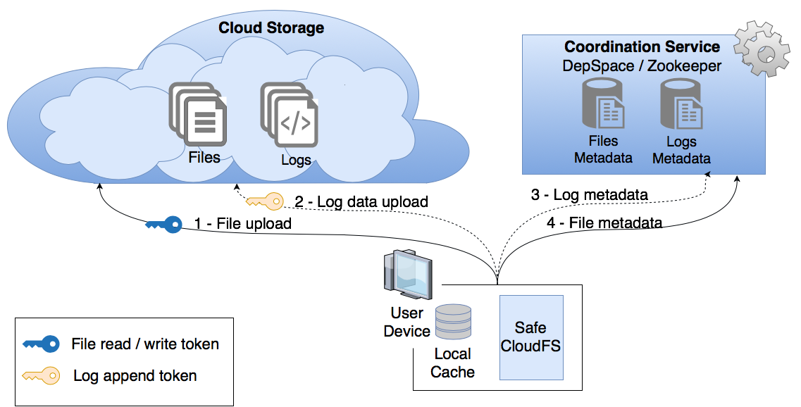

# SafeCloudFS aka RockFS

SafeCloudFS -- is a File System supported by a single cloud or cloud-of-clouds resilient to client side attacks.

SafeCloudFS provides two sets of security mechanisms to be integrated with the client-side of a file system:
 * a *recovery service* capable of undoing unintended file operations without losing valid file operations that occurred after the attack; and
 * *device data security mechanisms* to safely store encryption keys reducing the probability of having the credentials compromised by attackers and to protect cached data.

SafeCloudFS works with a single storage cloud or with several storage clouds (cloud-of-clouds). It is compatible with AWS-S3, BackBlaze B2, Google Cloud Storage, Microsoft AzureBlob and RackSpace Cloud Files. SafeCloudFS requires a coordination service an it is compatible with DepSpace and Zookeeper (to de implemented soon). For testing purposes it is also possible to test SafeCloudFS without a coordination service, in that case the metadata of the File System is kept in memory during execution and discarded afterwards. The figure below shows the system architecture of SafeCloudFS.



To perform recovery SafeCloudFS saves logs of file operations. Each log entry is composed by two parts, the data part, that goes to the storage clouds, and the metadata part, which goes to the coordination service. The figure below shows how loggin is done.



A video with an example of a file being recovered can be found [here](https://youtu.be/YisuzJhi28M).


## Getting Started


### Prerequisites

SafeCloudFS uses FUSE library. You need  to install the following tools before using SafeCloudFS.


| Supported platforms                                           |     |      |
|---------------------------------------------------------------|-----|------|
| Linux (sudo apt-get install libfuse-dev)                      | x64 | x86  |
| MacOS (via [osxfuse](https://osxfuse.github.io/))             | x64 | x86  |
| Windows (via [winfsp](https://github.com/billziss-gh/winfsp/))| x64 | n/a  |

Please make sure you have at least Java 7 installed and Maven.

### Installing

Before running SafeCloudFS execute the following command to install the required libs to you local Maven repository.

```
sh install.sh
```


## Running SafeCloudFS

Before executing SafeCloudFS edit the `safecloudfs.properties` file in `config` folder.

If you're planning to setup SafeCloudFS using DepSpace as the coordination service we recommend the following implementation of [DepSpace](https://github.com/inesc-id/depspacito).

Default execution arguments are set in the pom.xml file.

### Arguments

* --mount [path] - Directory to be mount
* --config [path] - Path for the SafeCloudFS configuration file (For example: config/safecloudfs.properties). More about the configuration file [here](doc/CONFIG_FILE.md).
* -- debug <ALL, SIMPLE, WARNING, SEVERE, INFO, FINE, FINER, FINEST> - Execute with debug log messages

### Running localy
```
mvn exec:java
```


### Running via Docker

If you intend to user DepSpace a the coordination service for SafeCloudFS, you need to start it first. Instructions on how to start DepSpace can be found [here](https://github.com/inesc-id/depspacito).

Before running SafeCloudFS first edit `config/accounts.json` with the access credentials to the cloud providers and `config/safecloudfs.properties` with the configuration of SafeCloudFS (for example, to indicate the path to the config folder of DepSpace or the address of the Zookeeper servers).

The Dockerfile in the root of the project allows to execute SafeCloudFS through a Debian VM. To build and run the VM execute the following commands:

```
docker build -t safecloudfs .
docker run -it --privileged --cap-add SYS_ADMIN --device /dev/fuse -i safecloudfs
```

Then inside the container execute

```
sh run.sh
```

Or execute the following command to mount a specific dir located in /path/to/dir:

```
sh run.sh /path/to/dir
```


### Running via Docker compose

First, edit the `accounts.json` and `safecloudfs.properties` files in the `docker-compose/SafeCloudFS` folder.

Then, inside the folder `docker-compose`, execute:

```
docker-compose up
```


## Built With

* [Google](http://www.dropwizard.io/1.0.2/docs/) - The web framework used
* [Maven](https://maven.apache.org/) - Dependency Management
* [JBDiff](https://github.com/jdesbonnet/jbdiff) - Used to create log entries of users' operations

## Authors

* **[David R. Matos](https://github.com/davidmatos)**
* **[Prof. Miguel Correia](https://github.com/mpcorreia)**
* **[Prof. Miguel L. Pardal](https://github.com/miguelpardal)**
* **[Prof. Georg Carle](https://www.net.in.tum.de/members/carle/)**

## License

This project is licensed under the MIT License - see the [LICENSE.md](LICENSE.md) file for details

## Acknowledgments

* Prof. Miguel Correia, Prof. Miguel L. Pardal and Prof. Georg Carle
* Alysson Bessani for the development of the PVSS lib used;
* The contributors of the [SCFS](https://github.com/cloud-of-clouds/SCFS), [DepSky](https://github.com/cloud-of-clouds/depsky), [DepSpace](https://github.com/bft-smart/depspace) and [SMaRT-BFT](https://github.com/bft-smart/library) projects.

